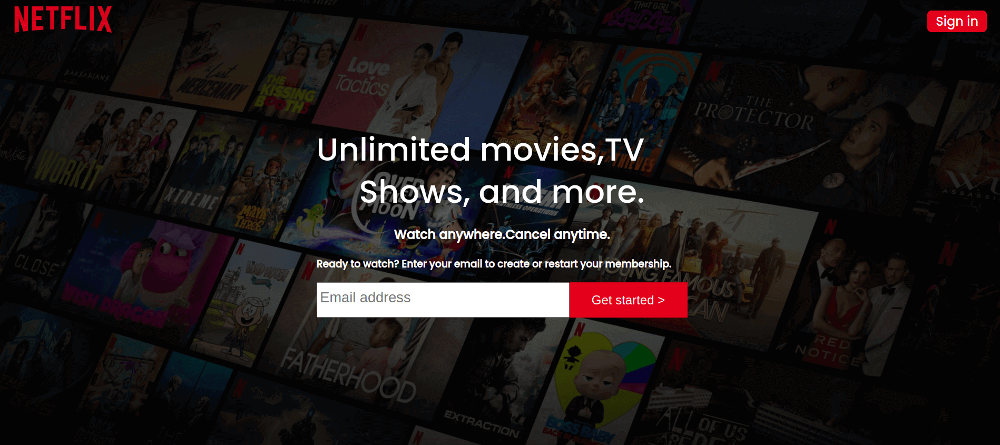

# Netflix-UI-clone
## Description
A website where I'm trying to clone the Ui of the netflix website

## Table of contents
<ul>
    <li>Description</li>
    <li>Installation requirements</li>
    <li>Technology used</li>
    <li>Development</li>
    <li>Reference</li>
    <li>License</li>
    <li>Authors information</li>
    
</ul>

## Installation requirements
You don't need to install anything you only need internet connection

## Technologies used
<ul>
   <li>HTML</li>
   <li>CSS</li>
</ul>

## Development
  Want to contribute? Okay cool;follow the following steps:
<ul>
   <li>Fork the repo</li>
   <li>Create a new branch</li>
   <li>Make appropriate changes in the files</li>
   <li>Add changes to reflect the changes made</li>
   <li>Commit your changes</li>
   <li>Push to a Branch</li>
   <li>Create a Pull request</li>
</ul>

## Live site
here is a working live demo: [link](https://bonface221.github.io/Netflix-UI-clone/)
## license
[license](/LICENSE)
## Authors
@bonface221